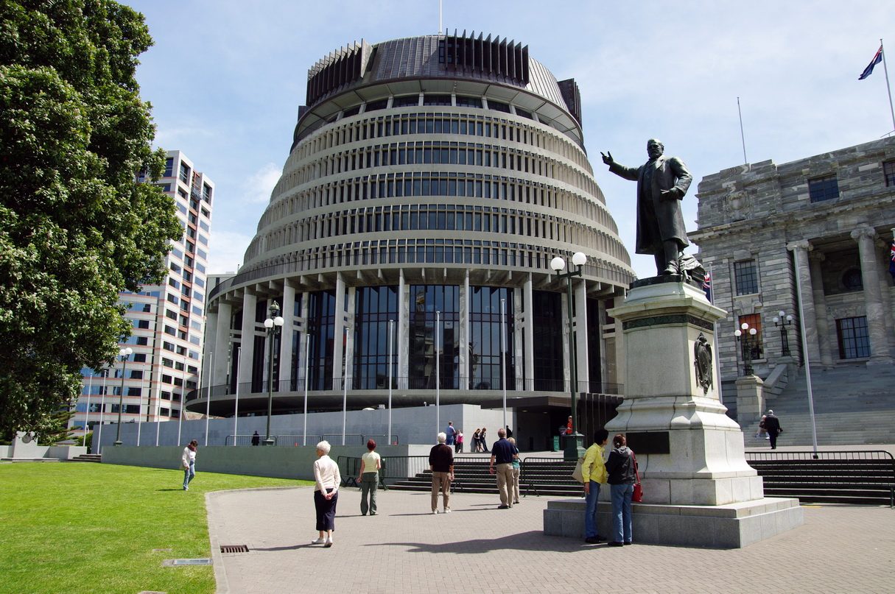
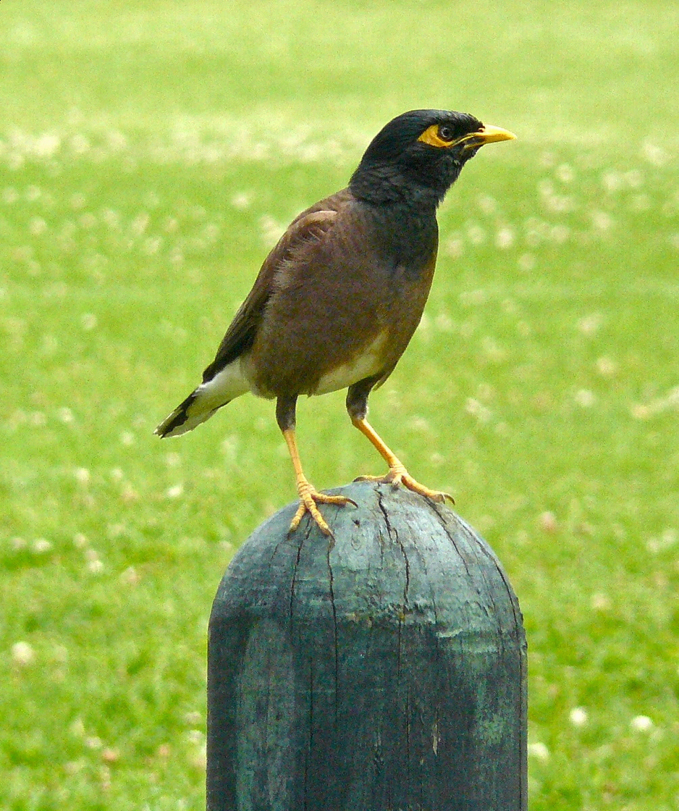

# Steganography
This python command-line application allows for easy steganography of images. That is, concealing and revealing images inside other images.

There are two programs; **conceal.py** and **read.py**. 

## conceal.py
This script takes in two images and conceals one into the other with no visible difference

To get a list of all the command-line arguments, run `python conceal.py`
The list is as follows:
  - -f : Path to image that will conceal other image (Required) 
  - -h : Path to image that will be concealed (Required) Note : This image will be automatically rescaled if it is too large
  - -o : Path to output location. Default is 'steg-concealed.png. Using png (or another lossless format) is necessary for the steganography to work
  - -u : The amount of bits per byte that are replaced. Default is 3. Increasing this amount will result in the target image being more visibly modified but higher resolution images can be hidden. Decreasing will do the opposite
  - -s : The amount of bits per byte of the hidden image that are kept. Default is 8. Reducing this will cause the recovered image to contain more artifacts but higher-res images can be hidden
  - -v : To stop the program from being verbose, use '-v no'

### Example
The first image was hidden into the second.

 

Here is the result

This was generated with `python conceal.py -f "bird.jpg" -h "beehive.jpg"`

## read.py
This script takes in a single image and extracts the concealed image. Providing a normal image or a concealed image that was encoded using a lossy format will produce garbage.

This script takes only three arguments and only '-f' is required
  - -f : Path to image with a concealed image inside of it
  - -o : Path to output location. Default is 'steg-out.png'
  - -v : To stop the program from being verbose, use '-v no'

### Example
If we run `python read.py -f "concealed_beehive.jpg"` on the image generated in the previous example, we get the following image. Note that this image is of smaller size than the original. This is because the program ahd to shrink it to fit it into the bird image

